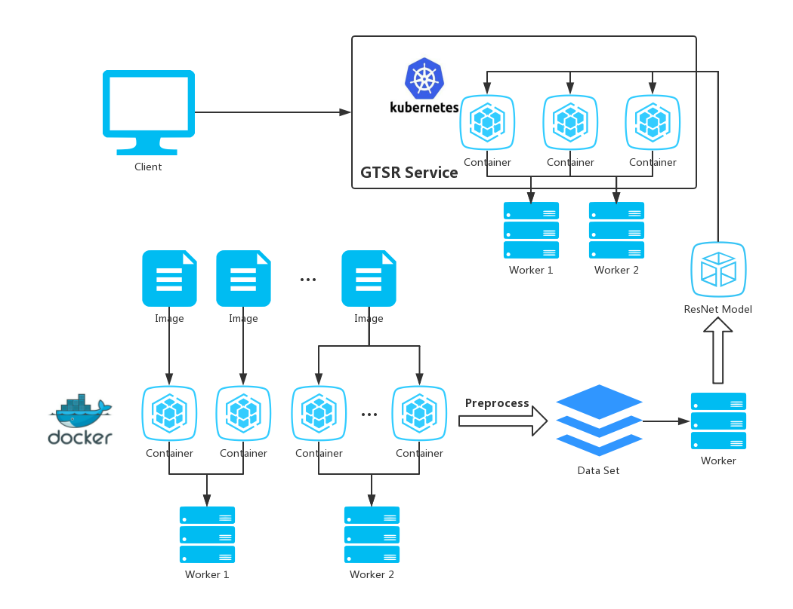

# Traffic Sign Recognition System

## The Repository
This repository is a German traffic sign recognition system implemented by ResNet and deployed by Kubernetes.

## Architecture

## Use it
You can download the **docker/gtsr_flask** folder directly and then build the image using Docker. After the gtsr_flask image is built completely, download the **docker/gtsr_k8s** folder, then use Kubernetes to deploy the corresponding container.
> The **opencv** image is needed. You need pull a opencv image from DockerHub and tag it before you build the gtsr_flask image. See more information in Dockerfile in **docker/gtsr_flask**.